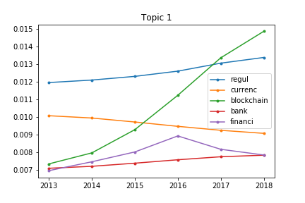
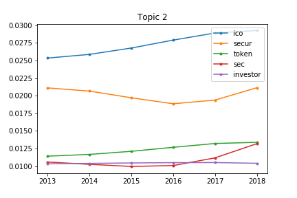
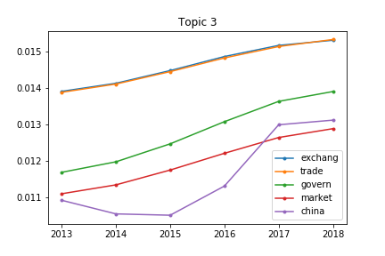
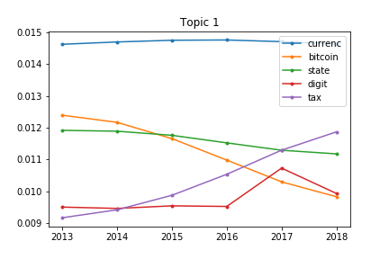
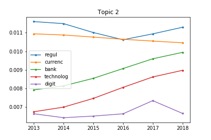
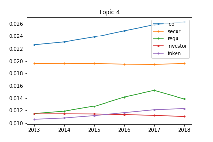
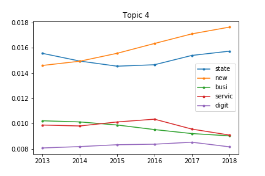
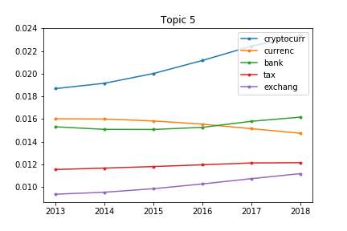

[](http://quantlet.de/)

## [](http://quantlet.de/) **DTM_Policy_Risk** [](http://quantlet.de/)

```yaml


Name of Quantlet: DTM_Policy_Risk 

Published in: LDA-DTM

Description: DTM application with Cryptocurrency Policy Regulation News

Keywords: LDA, DTM, Topic Models, Cryptocurrency, Policy Regulation 

Author: Xinwen Ni

Submitted:  30 Jan 2019


```


















### PYTHON Code
```python

#!/usr/bin/env python3
# -*- coding: utf-8 -*-
"""
Created on Sat Dec 15 20:39:16 2018

@author: xinwenni
"""

import os
import re
import pandas as pd
## `nltk.download('punkt')
import numpy as np
from nltk.corpus import stopwords
from os import path
from nltk.tokenize import RegexpTokenizer
from nltk.stem.porter import PorterStemmer
import nltk
nltk.download('stopwords')
from gensim import corpora
from collections import  defaultdict
from gensim.test.utils import common_corpus
from gensim.models import LdaSeqModel
from gensim.matutils import hellinger
from gensim.corpora import Dictionary, bleicorpus
import numpy
from gensim.models import ldaseqmodel
import matplotlib.pyplot as plt


def BasicCleanText(raw_text):
    cleantextprep = str(raw_text)
    
    expression = "[^a-zA-Z0-9 ]" # keep only letters, numbers and whitespace
    cleantextCAP = re.sub(expression, '', cleantextprep) # apply regex
    cleantext = cleantextCAP.lower() # lower case 
    
    # Tokenization
    tokenizer = RegexpTokenizer(r'\w+')
    tokens = tokenizer.tokenize(cleantext)

    # create English stop words list
    #en_stop = get_stop_words('en')
    stop = set(stopwords.words('english'))
    # remove stop words from tokens
    #stopped_tokens = [i for i in tokens if not i in en_stop]
    stopped_tokens = [i for i in tokens if not i in stop]
 
    # Create p_stemmer of class PorterStemmer
    p_stemmer = PorterStemmer()
    # stem token
    texts_clean = [p_stemmer.stem(i) for i in stopped_tokens]
    return texts_clean;


# load data
#df = pd.read_csv('df02.csv',encoding="ISO-8859-1")
df = pd.read_csv('dfsent02.csv',encoding="ISO-8859-1")

time=df['date']
df['year']=time.str.slice(0,4)       
df = pd.concat([df, pd.DataFrame(columns = ['year']),
                      pd.DataFrame(columns = ['clean_content'])])

time_stamps=np.arange(int(df.year.min(axis=0)),int(df.year.max(axis=0))+1,1)
time_stamps=list(time_stamps)

for i in range(len(df)):
    content=df.iat[i,3]
    content_clean=BasicCleanText(raw_text=content)
    content_clean=" ".join(content_clean)
    df.iat[i,4]=content_clean

# find out the time slice
gp=df.groupby(by=['year'])
total_yearly_list=list(gp.size())

documents=list(df['clean_content'])
stoplist=stopwords

stoplist = set('for a of the and to in'.split())
texts = [[word for word in document.lower().split() if word not in stoplist]
         for document in documents]

# drop the words only appers once
frequency = defaultdict(int)
for text in texts:
    for token in text:
        frequency[token] += 1
texts = [[token for token in text if frequency[token] > 1]
         for text in texts]

dictionary = corpora.Dictionary(texts)   # generate the dictionary
dictionary.compactify() #

dictionary.save(os.path.join('dictionary.dict')) # store the dictionary, for future reference
print(dictionary)

#Save vocabulary
vocFile = open(os.path.join( 'vocabulary.dat'),'w')
for word in dictionary.values():
    vocFile.write(word+'\n')
    
vocFile.close()
print(vocFile)

#Prevent storing the words of each document in the RAM
class MyCorpus(object):
     def __iter__(self):
         for document in documents:
             # assume there's one document per line, tokens separated by whitespace
             yield dictionary.doc2bow(document.lower().split())


corpus_memory_friendly = MyCorpus()

multFile = open(os.path.join( 'foo-mult.dat'),'w')

for vector in corpus_memory_friendly: # load one vector into memory at a time
    multFile.write(str(len(vector)) + ' ')
    for (wordID, weigth) in vector:
        multFile.write(str(wordID) + ':' + str(weigth) + ' ')

    multFile.write('\n')
    
multFile.close()

print(multFile)


time_slice=total_yearly_list

#LdaSeqModel(corpus=None, time_slice=None, id2word=None, alphas=0.01, num_topics=10, initialize='gensim', sstats=None, lda_model=None, obs_variance=0.5, chain_variance=0.005, passes=10, random_state=None, lda_inference_max_iter=25, em_min_iter=6, em_max_iter=20, chunksize=100)

#use LdaSeqModel to generate DTM results
ldaseq = LdaSeqModel(corpus=corpus_memory_friendly, id2word=dictionary, time_slice=time_slice, num_topics=4)
# for given time, the distriibution of each topic 
ldaseq.print_topics(time=1)
# for given topic the word distribution over time
DTM_topic_0=ldaseq.print_topic_times(topic=0, top_terms=10)
DTM_topic_1=ldaseq.print_topic_times(topic=1, top_terms=10)
DTM_topic_2=ldaseq.print_topic_times(topic=2, top_terms=10)
DTM_topic_3=ldaseq.print_topic_times(topic=3, top_terms=10)
DTM_topic_4=ldaseq.print_topic_times(topic=4, top_terms=10)

def topic_time(DTM_topic,time_stamps):  
    for i in range(len(time_slice)-1):
        if i==0:
            temp_a1=pd.DataFrame(DTM_topic[i])
            temp_a2=pd.DataFrame(DTM_topic[i+1])
            temp_a1.columns = ['words', time_stamps[i]]
            temp_a2.columns = ['words', time_stamps[i+1]]
            temp_a1=pd.merge(temp_a1,temp_a2)
        else:
            temp_a2=pd.DataFrame(DTM_topic[i+1])
            temp_a2.columns = ['words', time_stamps[i+1]]
            temp_a1=pd.merge(temp_a1,temp_a2)
    topic_words_time=temp_a1
    return topic_words_time
   
topic1_words_time=topic_time(DTM_topic_0,time_stamps)
topic2_words_time=topic_time(DTM_topic_1,time_stamps)
topic3_words_time=topic_time(DTM_topic_2,time_stamps)
topic4_words_time=topic_time(DTM_topic_3,time_stamps)
topic5_words_time=topic_time(DTM_topic_4,time_stamps)


##plot the dynamic movement of topic 1
#topic1_words=list(topic1_words_time['words'])
#plt.figure()
#for i in range(0,5):
#    plt.plot(time_stamps, topic1_words_time.ix[i,1:],marker=".",label=topic1_words[i])
##plt.xlim((-1, 2))
##plt.ylim((0, 0.02))
#plt.legend(loc='best')
#plt.title('Topic 1')
#plt.savefig('Topic1.png',transparent=True)
#plt.show()

#plot the dynamic movement of topic 1
topic1_words=list(topic1_words_time['words'])
plt.figure()
for i in range(0,5):
    plt.plot(time_stamps, topic1_words_time.ix[i,1:],marker=".",label=topic1_words[i])
#plt.xlim((-1, 2))
#plt.ylim((0, 0.02))
plt.legend(loc='best')
plt.title('Topic 1')
plt.savefig('Topic4-1.png',transparent=True)
plt.show()


#plot the dynamic movement of topic2
topic=topic2_words_time
topic_words=list(topic['words'])
plt.figure()
for i in range(1,6):
    plt.plot(time_stamps, topic.ix[i,1:],marker=".",label=topic_words[i])
#plt.xlim((-1, 2))
#plt.ylim((0, 0.02))
plt.legend(loc='best')
plt.title('Topic 2')
plt.savefig('Topic4-2.png',transparent=True)
plt.show()


#plot the dynamic movement of topic3
topic=topic3_words_time
topic_words=list(topic['words'])
plt.figure()
for i in range(0,5):
    plt.plot(time_stamps, topic.ix[i,1:],marker=".",label=topic_words[i])
#plt.xlim((-1, 2))
#plt.ylim((0, 0.02))
plt.legend(loc='best')
plt.title('Topic 3')
plt.savefig('Topic4-3.png',transparent=True)
plt.show()

#plot the dynamic movement of topic4
topic=topic4_words_time
topic_words=list(topic['words'])
plt.figure()
for i in range(0,5):
    plt.plot(time_stamps, topic.ix[i,1:],marker=".",label=topic_words[i])
#plt.xlim((-1, 2))
#plt.ylim((0, 0.02))
plt.legend(loc='best')
plt.title('Topic 4')
plt.savefig('Topic4-4.png',transparent=True)
plt.show()


#plot the dynamic movement of topic5
topic=topic5_words_time
topic_words=list(topic['words'])
plt.figure()
for i in [0,1,2,4,5]:
    plt.plot(time_stamps, topic.ix[i,1:],marker=".",label=topic_words[i])
#plt.xlim((-1, 2))
#plt.ylim((0, 0.02))
plt.legend(loc='best')
plt.title('Topic 5')
plt.savefig('Topic5.png',transparent=True)
plt.show()

```

automatically created on 2019-02-04