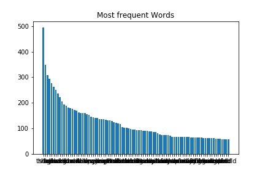
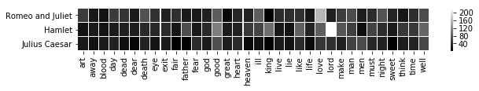
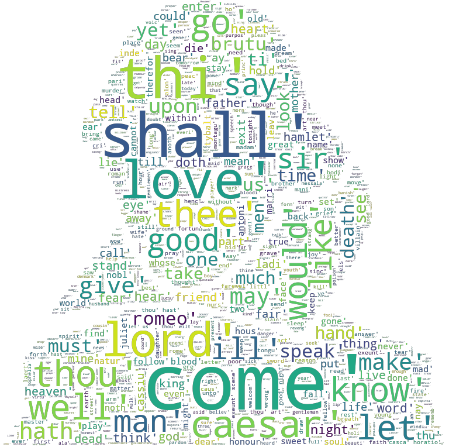

[](http://quantlet.de/)

## [](http://quantlet.de/) **LDA-DTM_Shakespeare_LDA** [](http://quantlet.de/)

```yaml


Name of Quantlet: LDA-DTM_Shakespeare_LDA   

Published in: LDA-DTM

Description: "Analyse the word frequency and the topic distribution of Shakespeare's works: Hamlet, Julius Caesar and Romeo and Juliet"  

Keywords: LDA, Shakespeare, topic modelling, word frequency, word cloud 

See also: LDA-DTM_NASDAQ, LDA-DTM_Regulation_Risk, LDA-DTM_Speech_Xijinping

Author: Xinwen Ni

Submitted:  01 OCT 2018


```








### PYTHON Code
```python

#!/usr/bin/env python3
# -*- coding: utf-8 -*-
"""
Created on Wed Oct 24 22:15:37 2018

@author: verani
"""

#please install the modules before you run this code:
#!pip install matplotlib
#!pip install nltk
#!pip install gensim

import os
import re
import nltk
nltk.download('punkt')
from os import path
from nltk.stem import WordNetLemmatizer 
from nltk.stem.porter import PorterStemmer
from nltk.corpus import stopwords
import nltk
# Importing Gensim
import gensim
from gensim import corpora

# Please change the working directory to your path!
#os.chdir("/Users/xinwenni/LDA-DTM/Shakespeare") 
d = os.getcwd()


text_pre = open(path.join(d, 'three_tragedy.txt'), encoding = "utf8").read()

doc_l = str.split(text_pre)

#doc_l.pop()[0]

doc_complete = doc_l

doc_out = []
for l in doc_l:
    
    cleantextprep = str(l)
    
    # Regex cleaning
    expression = "[^a-zA-Z ]" # keep only letters, numbers and whitespace
    cleantextCAP = re.sub(expression, '', cleantextprep) # apply regex
    cleantext = cleantextCAP.lower() # lower case 
    bound = ''.join(cleantext)
    doc_out.append(bound)

doc_complete = doc_out


import string

stop = set(stopwords.words('english'))

exclude = set(string.punctuation) 
lemma = WordNetLemmatizer()

nltk.download('wordnet')
def clean(doc):
    stop_free = " ".join([i for i in doc.lower().split() if i not in stop])
    punc_free = ''.join(ch for ch in stop_free if ch not in exclude)
    normalized = " ".join(lemma.lemmatize(word) for word in punc_free.split())
    return normalized


doc_clean = [clean(doc).split() for doc in doc_complete]    


# Creating the term dictionary of our courpus, where every unique term is assigned an index.
dictionary = corpora.Dictionary(doc_clean)

# Converting list of documents (corpus) into Document Term Matrix using dictionary prepared above.
doc_term_matrix = [dictionary.doc2bow(doc) for doc in doc_clean]

# Creating the object for LDA model using gensim library
Lda = gensim.models.ldamodel.LdaModel
K=3
# Running and Trainign LDA model on the document term matrix.
ldamodel = Lda(doc_term_matrix, num_topics=K, id2word = dictionary, passes=20)

print(ldamodel.print_topics(num_topics=K, num_words=10))

topicWordProbMat=ldamodel.print_topics(K)


```

automatically created on 2020-10-17