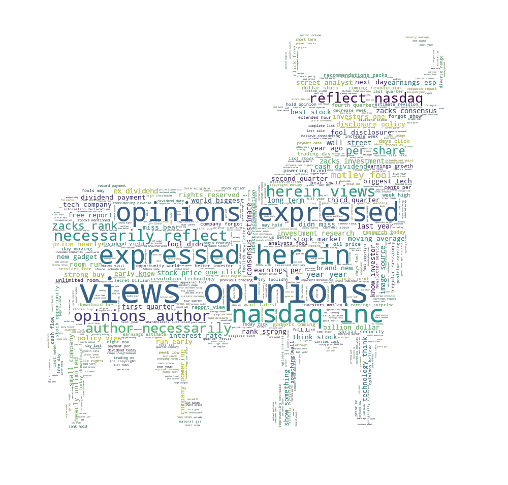

[](http://quantlet.de/)

## [](http://quantlet.de/) **LDA_NASDAQ** [](http://quantlet.de/)

```yaml


Name of Quantlet: LDA_NASDAQ   

Published in: LDA-DTM

Description: 'LDA application with NASDAQ news, the word cloud, and word frequency' 

Keywords: LDA, NASDAQ news, topic modelling, word cloud, word frequency

Author: Xinwen Ni

Submitted:  01 OCT 2018

Notes: Please download NASDAQ data from https://drive.google.com/file/d/1eAw4_3y1VhBuiYZdxkqbc8dF89yhf-uM/view?usp=sharing 

```




### PYTHON Code
```python

#!/usr/bin/env python3
# -*- coding: utf-8 -*-
"""
Created on Tue May  8 09:34:47 2018

@author: verani
"""

import os
import json

import re
import nltk
nltk.download('punkt')
from nltk.stem import WordNetLemmatizer 
from nltk.stem.porter import PorterStemmer
from nltk.corpus import stopwords
from wordcloud import WordCloud, STOPWORDS
import numpy as np
from os import path

import matplotlib.pyplot as plt

import nltk

from PIL import Image


root_path= os.getcwd()

with open(root_path + '/NASDAQ_News_2016.json', 'r') as json_file:
    nasdaq_news_2016 = json.load(json_file)
    


TempTry=nasdaq_news_2016
n=len(TempTry)
All=''.split()
for i in range(n):
    temp1=TempTry[i]
    temp2=temp1['article_content']
    All.append(temp2)

string= ""
allT=string.join(All)


#subsample=nasdaq_news_2016[0:10]
#n_sample=len(subsample)
#sample1=''.split()
#for i in range(2):
#    temp1=subsammple[i]
#    temp2=temp1['article_content']
#    sample1.append(temp2)
#
#string= ""
#sampleTXT=string.join(sample1)


expression = "[^a-zA-Z0-9 ]" # keep only letters, numbers and whitespace
cleantextCAP = re.sub(expression, ' ', allT) # apply regex
cleantext = cleantextCAP.lower() # lower case 


text_file = open("Output_content.txt", "w")
text_file.write(str(cleantext))
text_file.close()


#wordcloud 
# Read the whole text.


with open(path.join(root_path, 'Output_content.txt'), 'r', encoding='utf-8', errors='ignore') as outout_file:
    text = outout_file.readlines()

# Mask
nasdaq_pic = np.array(Image.open(path.join(root_path, "nasdaq_bull.png")))

# Optional additional stopwords
stopwords = set(STOPWORDS)


# Construct Word Cloud
# no backgroundcolor and mode = 'RGBA' create transparency
wc = WordCloud(max_words=1000, mask=nasdaq_pic,
               stopwords=stopwords, mode='RGBA', background_color=None)

# Pass Text
wc.generate(text[0])

# store to file
wc.to_file(path.join(root_path, "wordcloud_nasdaq_content.png"))


cleantext= open(path.join(root_path, 'Output_content.txt'), encoding = "utf8").read()
words=cleantext.split()
dict1 = {}
for word in words:			
    dict1[word] = dict1.get(word,0) + 1


# Filter Stopwords
keys = list(dict1)
import nltk
nltk.download('stopwords')
filtered_words = [word for word in keys if word not in stopwords.words('english')]
dict2 = dict((k, dict1[k]) for k in filtered_words if k in filtered_words)

with open('dict_2016.json', 'w') as f:
    json.dump(dict2, f)

def SequenceSelection(dictionary, length, startindex = 0): # length is length of highest consecutive value vector
    
    # Test input
    lengthDict = len(dictionary)
    if length > lengthDict:
        return print("length is longer than dictionary length");
    else:
        d = dictionary
        items = [(v, k) for k, v in d.items()]
        items.sort()
        items.reverse()   
        itemsOut = [(k, v) for v, k in items]
    
        highest = itemsOut[startindex:startindex + length]
        dd = dict(highest)
        wanted_keys = dd.keys()
        dictshow = dict((k, d[k]) for k in wanted_keys if k in d)

        return dictshow;
    
dictshow = SequenceSelection(dictionary = dict2, length = 10, startindex = 0)


# Plot most frequent words
n = range(len(dictshow))
plt.bar(n, dictshow.values(), align='center')
plt.xticks(n, dictshow.keys())
plt.title("Most frequent Words")
plt.savefig("FrequentWords.png", transparent=True)


# find the crypto currency related words frequency
str_crypto=['bitcoin','BTC','cryptocurrency','coin']
words.count('bitcoin')
for index in range(len(str_crypto)):
    print(words.count(str_crypto[index]))


```

automatically created on 2019-02-06
