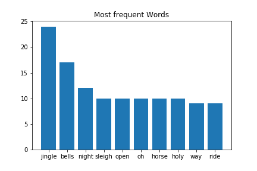

[](http://quantlet.de/)

## [](http://quantlet.de/) **LDA_Christmas_Songs** [](http://quantlet.de/)

```yaml


Name of Quantlet: LDA_Christmas_Songs  

Published in: LDA-DTM

Description: Compare two Christmas Songs with LDA

Keywords: LDA, word cloud, topic modelling, Christmas Song

Author: Xinwen Ni

Submitted:  01 OCT 2018


```




### PYTHON Code
```python

#!/usr/bin/env python3
# -*- coding: utf-8 -*-
"""
Created on Sun May  6 19:10:18 2018

@author: verani
"""
# wordcloud 
import matplotlib.pyplot as plt
import re
from nltk.corpus import stopwords
import os

from os import path
from PIL import Image
from wordcloud import WordCloud, STOPWORDS
import numpy as np

d = os.getcwd()

raw_text= open(path.join(d, 'XMAS SONG.txt'), encoding = "utf8").read()
raw_text= raw_text.replace("\n"," ")

cleantextprep = str(raw_text)


# keep only letters, numbers and whitespace
expression = "[^a-zA-Z0-9 ]" 
cleantextCAP = re.sub(expression, '', cleantextprep) # apply regex
cleantext = cleantextCAP.lower() # lower case 


text_file = open("Output_total.txt", "w")
text_file.write(str(cleantext))
text_file.close()


root_path = os.getcwd()

# Read the whole text.
with open(path.join(root_path, 'Output_total.txt'), 'r', encoding='utf-8', errors='ignore') as outout_file:
    text = outout_file.readlines()

# Mask
xmas_tree_pic = np.array(Image.open(path.join(root_path, "xmas_tree2.png")))

# Optional additional stopwords
stopwords = set(STOPWORDS)
stopwords.add("song")

# Construct Word Cloud
# no backgroundcolor and mode = 'RGBA' create transparency
wc = WordCloud(max_words=100, mask=xmas_tree_pic,
               stopwords=stopwords, mode='RGBA', background_color=None)

# Pass Text
wc.generate(text[0])

# store to file
wc.to_file(path.join(root_path, "wordcloud_xmas_tree.png"))


# LDA


import os
import re
import nltk
nltk.download('punkt')
from os import path
from nltk.stem import WordNetLemmatizer 
from nltk.stem.porter import PorterStemmer
from nltk.corpus import stopwords

d = os.getcwd()


text_pre = open(path.join(d, 'XMAS SONG.txt'), encoding = "utf8").read()
#text= text_pre.replace("\n"," ")
#text_file = open("XMAS SONG.txt", "w")
#text_file.write(str(text))
#text_file.close()

doc_l = str.split(text_pre, sep = 'SONG')
#doc_l.pop()[0]

doc_complete = doc_l

doc_out = []
for l in doc_l:
    
    cleantextprep = str(l)
    
    # Regex cleaning
    expression = "[^a-zA-Z ]" # keep only letters, numbers and whitespace
    cleantextCAP = re.sub(expression, '', cleantextprep) # apply regex
    cleantext = cleantextCAP.lower() # lower case 
    bound = ''.join(cleantext)
    doc_out.append(bound)

doc_complete = doc_out

from nltk.corpus import stopwords 
from nltk.stem.wordnet import WordNetLemmatizer
import string

stop = set(stopwords.words('english'))
stop.add('SONG')

exclude = set(string.punctuation) 
lemma = WordNetLemmatizer()
import nltk
nltk.download('wordnet')
def clean(doc):
    stop_free = " ".join([i for i in doc.lower().split() if i not in stop])
    punc_free = ''.join(ch for ch in stop_free if ch not in exclude)
    normalized = " ".join(lemma.lemmatize(word) for word in punc_free.split())
    return normalized


doc_clean = [clean(doc).split() for doc in doc_complete]    


# Importing Gensim
import gensim
from gensim import corpora

# Creating the term dictionary of our courpus, where every unique term is assigned an index.
dictionary = corpora.Dictionary(doc_clean)

# Converting list of documents (corpus) into Document Term Matrix using dictionary prepared above.
doc_term_matrix = [dictionary.doc2bow(doc) for doc in doc_clean]


# Creating the object for LDA model using gensim library
Lda = gensim.models.ldamodel.LdaModel

# Running and Trainign LDA model on the document term matrix.
ldamodel = Lda(doc_term_matrix, num_topics=2, id2word = dictionary, passes=20)

#print(ldamodel.print_topics(num_topics=3, num_words=5))
K=2
topicWordProbMat=ldamodel.print_topics(K)


import pandas as pd
import numpy as np

columns = ['1','2']
df = pd.DataFrame(columns = columns)
pd.set_option('display.width', 1000)

# 20 need to modify to match the length of vocabulary 
zz = np.zeros(shape=(20,K))

last_number=0
DC={}

for x in range (20):
  data = pd.DataFrame({columns[0]:"",
                     columns[1]:"",
#                     columns[2]:"",
#                     columns[3]:"",
#                     columns[4]:"",                                                                                                    
                    },index=[0])
  df=df.append(data,ignore_index=True)  

for line in topicWordProbMat:
    
    tp, w = line
    probs=w.split("+")
    y=0
    for pr in probs:
               
        a=pr.split("*")
        df.iloc[y,tp] = a[1]
       
        if a[1] in DC:
           zz[DC[a[1]]][tp]=a[0]
        else:
           zz[last_number][tp]=a[0]
           DC[a[1]]=last_number
           last_number=last_number+1
        y=y+1

print (df)
print (zz)


import matplotlib.pyplot as plt

zz=np.resize(zz,(len(DC.keys()),zz.shape[1]))

for val, key in enumerate(DC.keys()):
        plt.text(-2.5, val + 0.5, key,
                 horizontalalignment='center',
                 verticalalignment='center'
                 )

#plt.imshow(zz, cmap='hot', interpolation='nearest')
plt.imshow(zz, cmap=plt.cm.gray, interpolation='nearest')
#plt.show()
plt.yticks([])
# plt.title("heatmap xmas song")
plt.savefig("heatmap xmas song.png", transparent = True)


```

automatically created on 2019-02-04